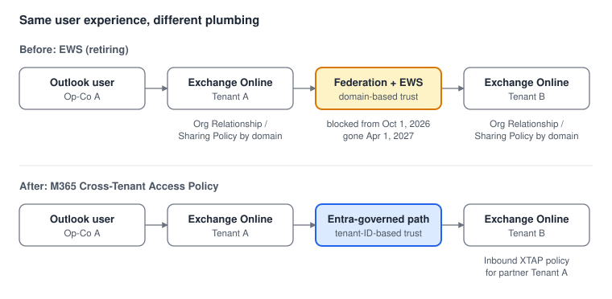
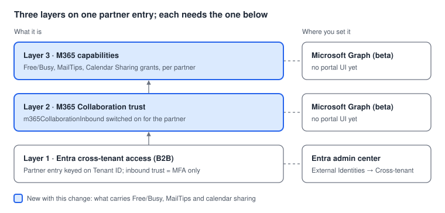
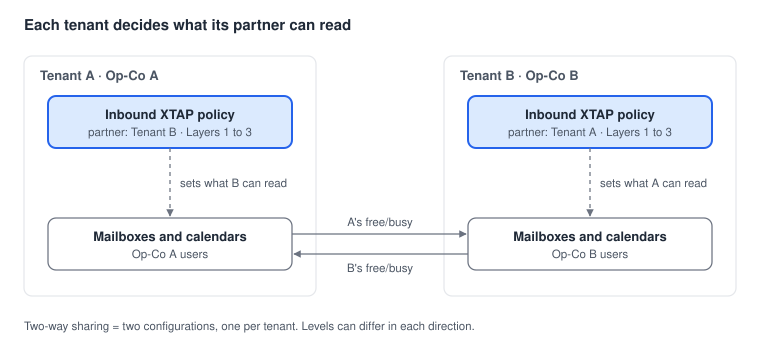

# Cross-Tenant Calendar Sharing: How It Works

Read this first. It explains what's moving, why, and where each setting lives. When you're ready to do the work, the [migration checklist](02-migration-checklist.md) is the runbook for moving existing sharing off EWS, and [new partner setup](03-new-partner-setup.md) covers sharing with a tenant you've never shared with before.

## The short version

For end users nothing changes: someone in Op-Co A schedules a meeting, adds a colleague from Op-Co B, and Scheduling Assistant shows B's availability. What changes is the plumbing underneath. The old path was **Exchange-to-Exchange over EWS, trusted by domain name**. The new path is **governed by Entra, trusted by tenant ID**, and configured as part of the same Cross-Tenant Access Policy you already use for B2B.

## Before and after

The old model was built entirely inside Exchange Online. Each tenant created an Organization Relationship (Free/Busy, MailTips) and/or a Sharing Policy (calendar sharing) that named the partner by SMTP domain. Requests were carried over EWS and trusted through Microsoft's federation infrastructure, which is why domain details (including the partner's `onmicrosoft.com` domain, and autodiscover) mattered.

The new model moves the trust decision out of Exchange and into Entra. The partner is identified by Tenant ID, and whether a request is honored is decided by the partner entry in the target tenant's Cross-Tenant Access Policy.

The hop that changes is the trust in the middle: domain-matched federation over EWS gives way to a tenant-ID-keyed decision made by Entra in the tenant being asked.

## The three layers

"Cross-Tenant Access Policy" is used loosely for two different things, which is the main source of confusion. The Entra B2B settings you've used for years are the bottom layer. The calendar-sharing pieces are two new layers that sit on top of the same partner entry, and neither does anything without the one below it.

The grid in Entra admin center only shows Layer 1. Seeing a partner listed there as "Configured" says nothing about whether Layers 2 and 3 exist.

## Who configures what: inbound, per tenant

The new policy is **inbound only**. The settings in a tenant decide what a *partner* can read from *that* tenant. So configuration in Tenant A controls what Op-Co B sees of A, and configuration in Tenant B controls what Op-Co A sees of B. Two-way sharing means two complementary configurations, one in each tenant, and they don't have to match. A can share full detail with B while B shares availability only with A.

With several operating companies, think in **pairs**: every pair that shares needs a partner entry in each of the two tenants, pointing at the other.

When A's users can't see B, the fix is in Tenant B, not Tenant A.

## Mapping old settings to new

| Old (EWS) setting | What it did | New (M365 XTAP) equivalent |
| --- | --- | --- |
| Organization Relationship: `FreeBusyAccessLevel AvailabilityOnly` | Free/busy times only | Free/Busy **basic** capability (`crossTenantCalendarAvailabilityBasic`) |
| Organization Relationship: `FreeBusyAccessLevel LimitedDetails` | Times plus subject and location | Free/Busy **limited detail** capability |
| Organization Relationship: `MailTipsAccessLevel Limited / All` | Out-of-office and other MailTips | MailTips **limited / all** capability |
| Sharing Policy: `CalendarSharingFreeBusySimple / Detail / Reviewer` | Person-to-person calendar share invitations | Calendar Sharing **simple / detail / reviewer** capability |
| Sharing Policy: `Anonymous:` rules | Publishing a calendar to an internet URL | Anonymous variants of the calendar capabilities |
| `DomainNames` on the relationship | Identified the partner | Partner **Tenant ID** on the XTAP partner entry |
| `FreeBusyAccessScope` (a group) | Limited which of your users were visible | Optional security group scoping on the capability |
| Availability Address Space (`OrgWideFBToken`) | Org-wide free/busy trust to another tenant | Covered by the same XTAP partner entry |

Exact capability identifiers are in the Microsoft Learn migration guide's table; confirm them there, since the beta surface is still settling.

## Where each piece lives

| Piece | Where you work with it | Notes |
| --- | --- | --- |
| Layer 1: Entra B2B partner entry | Entra admin center → External Identities → Cross-tenant access settings | Existing grid; only MFA is trusted inbound in this environment |
| Layer 2: M365 Collaboration trust | Microsoft Graph (beta) | No portal UI yet |
| Layer 3: M365 capabilities | Microsoft Graph (beta) | No portal UI yet |
| Old Organization Relationships / Sharing Policies | Exchange Online PowerShell | Used for discovery, then disabled and removed |
| Proof it works | Outlook Scheduling Assistant, MailTips, calendar share invites | Test each pair in both directions |

## Common misconceptions

- **"We already have a cross-tenant access policy for them."** You probably have Layer 1 (B2B). That alone does not carry Free/Busy. Layers 2 and 3 are separate settings on the same partner entry.
- **"We need their onmicrosoft.com domain."** Not anymore. Nothing in the new model is domain-based; the Tenant ID is the only identifier.
- **"Configuring our side turns on sharing both ways."** It only controls what the partner can read from you. The partner has to configure their side for you to see them.
- **"This touches Exchange hybrid."** It doesn't. Hybrid and on-premises free/busy follow separate guidance; this covers tenant-to-tenant sharing in Exchange Online.
- **"Once EWS is blocked, the old settings are harmless."** They stop working, but leaving them around invites confusion during troubleshooting. Disable after validation, remove after a burn-in.

## References

- [Migrate to Microsoft 365 Cross-Tenant Access Policy for sharing Free/Busy, Calendars, and MailTips](https://learn.microsoft.com/en-us/exchange/sharing/migrate-to-m365-xtap) (Microsoft Learn)
- [Cross-tenant Free/Busy, MailTips, and Calendar Sharing are moving to Cross-Tenant Access Policy](https://techcommunity.microsoft.com/blog/exchange/cross-tenant-freebusy-mailtips-and-calendar-sharing-are-moving-to-cross-tenant-a/4545169) (Exchange Team Blog, MC1446796)
- [Cross-tenant access settings](https://learn.microsoft.com/en-us/entra/external-id/cross-tenant-access-settings-b2b-collaboration) (Microsoft Learn, Layer 1)
- [Retirement of Exchange Web Services in Exchange Online](https://techcommunity.microsoft.com/blog/exchange/retirement-of-exchange-web-services-in-exchange-online/3924440) (Exchange Team Blog)
