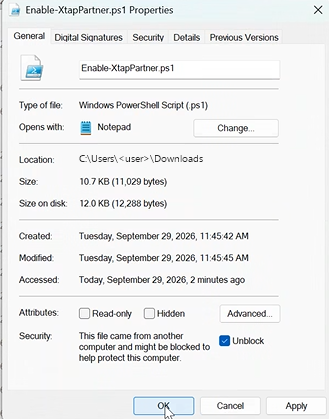
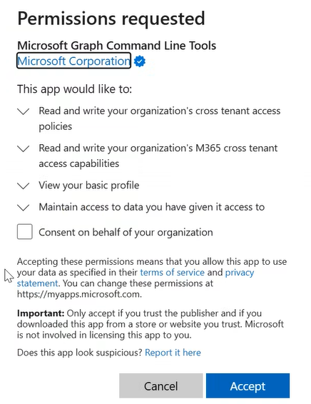

# Runbook: Set Up New Sharing

Last updated: September 29, 2026. New to this? Read [How It Works](01-how-it-works.md) first.

## When to use this doc

Use this runbook when two tenants need to share and **neither has any EWS-era configuration for the other**, for example a newly acquired op-co, or two op-cos that never shared. If either has an Organization Relationship, Sharing Policy rule, or Availability Address Space for the other, use [Migrate Existing Sharing](02-migrate-existing-sharing.md) instead.

Each side checks the partner in the portal, runs one script, and checks the result; then both sides test together.

## Before you start

**Agree with the partner on what each side shares.** Each side decides what the other may see of it, and the two don't have to match. Names are case-sensitive.

| Need | Capability |
| --- | --- |
| See when people are free or busy (times only) | `crossTenantCalendarAvailabilityBasic` |
| Free/busy plus meeting subject and location | `crossTenantCalendarAvailabilityLimitedDetails` |
| MailTips that prevent an NDR, plus automatic replies | `crossTenantMailTipsLimited` |
| All MailTips (out of office, automatic replies, large audience, custom) | `crossTenantMailTipsAll` |
| Users can share their calendar with partner users: times only | `crossTenantCalendarSharingFreeBusySimple` |
| Users can share their calendar: times, subject, location | `crossTenantCalendarSharingFreeBusyDetail` |
| Users can share their full calendar | `crossTenantCalendarSharingFreeBusyReviewer` |

Scheduling Assistant only needs the first one, the script's default. Grant the others only if the business asks.

**Collect from the partner:**

- Their **Tenant ID** (Entra admin center → Identity → Overview). Domains aren't needed.
- An admin who will configure their side and test with you.
- Confirmation they're on Exchange Online (not on-premises or hybrid).

**Confirm in your own tenant:**

- **The rollout has reached both tenants** (Message Center MC1446796).
- **No leftover EWS-era config** for this partner: run the [discovery commands](02-migrate-existing-sharing.md#step-1-discovery). If anything matches, including a wildcard `*` Sharing Policy rule, use Migrate Existing Sharing.
- **Roles:** Step 1: Security Administrator or Global Administrator. Step 2: **Global Administrator**. Step 3: Global Administrator, or Global Reader once an admin has approved the tool.
- **Only some users visible to the partner?** The script always grants to all users; use the [manual steps](#appendix-manual-powershell-steps) with a security group.

## Step 1: Confirm the partner organization exists in Entra admin center (Layer 1)

Go to **Entra admin center → Identity → External Identities → Cross-tenant access settings → Organizational settings** and find the partner. It's usually already there. If it's missing, select **Add organization**, enter its Tenant ID, and select **Add**. Don't change its trust settings (MFA, device trust); they apply to B2B guest sign-ins, not calendar sharing.

## Step 2: Turn on sharing with Enable-XtapPartner.ps1 (Layers 2 and 3)

There's no portal UI for Layers 2 and 3, so [Enable-XtapPartner.ps1](Enable-XtapPartner.ps1) does them: it turns on M365 Collaboration trust and grants the capabilities you agreed. It won't change Layer 1.

### Get ready

- **The scripts**: download `Enable-XtapPartner.ps1` and `Test-XtapPartner.ps1` into one folder and [unblock them](#unblock-the-downloaded-scripts).
- **PowerShell 7** (5.1 should also work), opened in that folder. If the execution policy blocks the scripts, run `Set-ExecutionPolicy -Scope Process Bypass` (this window only).
- **Values**: `-TenantId` is *your* tenant; `-PartnerTenantId` is the partner's; `-Capability` only if you need more than Free/Busy times (names from [Before you start](#before-you-start), comma-separated).

### Unblock the downloaded scripts

Windows blocks scripts downloaded through a browser. A blocked script fails with *"…is not digitally signed. You cannot run this script on the current system."* Unblock both once, either way:

- **File Explorer**: right-click → **Properties** → tick **Unblock** → **OK**. No checkbox means it isn't blocked.
- **PowerShell**, in the folder with the scripts:

  ```powershell
  Unblock-File -Path .\Enable-XtapPartner.ps1, .\Test-XtapPartner.ps1
  ```



Files from `git clone` don't need unblocking.

### Run it

```powershell
# Free/Busy times only (the default)
.\Enable-XtapPartner.ps1 -TenantId <your-tenant-id> -PartnerTenantId <partner-tenant-id>

# Example: Free/Busy times and all MailTips
.\Enable-XtapPartner.ps1 -TenantId <your-tenant-id> -PartnerTenantId <partner-tenant-id> `
    -Capability crossTenantCalendarAvailabilityBasic, crossTenantMailTipsAll
```

1. **Sign in.** Open the URL the script prints, enter the code, and sign in as a Global Administrator of **your** tenant.
2. **Consent (first time per tenant).** Microsoft shows a **Permissions requested** prompt for Microsoft Graph Command Line Tools. The first two lines are what the script needs; the others are standard sign-in permissions. **Leave "Consent on behalf of your organization" unticked**, then select **Accept**.

   
3. **Confirm each change** back in PowerShell:

   ```text
   Confirm
   Are you sure you want to perform this action?
   Performing the operation "Turn on M365 Collaboration trust for all users" on target "partner <partner-tenant-id>".
   [Y] Yes  [A] Yes to All  [N] No  [L] No to All  [S] Suspend  [?] Help (default is "Y"):
   ```

   Check the partner ID, then type **Y** (or **A** for all). **N** skips that change. **Enter alone counts as Yes.** There's one prompt per change needed; none if everything is already set.

A successful run ends with a summary like this:

```text
Signed in.
Layer 2: M365 Collaboration trust turned on.
Layer 3: granted crossTenantCalendarAvailabilityBasic to partner (all users).

Partner <partner-tenant-id>, as configured in tenant <your-tenant-id>
  M365 Collaboration trust: allowed for all users
  Capability: crossTenantCalendarAvailabilityBasic: allowed for all users
```

"Already on" or "no change" lines are fine, and rerunning is always safe (e.g. to add a capability later). `-WhatIf` previews without changing anything; `-Confirm:$false` skips the prompts.

### If the script stops

| Message | What it means | What to do |
| --- | --- | --- |
| `… is not digitally signed. You cannot run this script on the current system.` | The downloaded script is still blocked. | [Unblock it](#unblock-the-downloaded-scripts) and run it again. |
| `… cannot be loaded because running scripts is disabled on this system.` | The execution policy blocks scripts. | Run `Set-ExecutionPolicy -Scope Process Bypass`, then run it again. |
| `No cross-tenant access entry for partner …` | The partner isn't under Organizational settings. | Add it in the portal ([Step 1](#step-1-confirm-the-partner-organization-exists-in-entra-admin-center-layer-1)), then run the script again. |
| `Layer 2: … already set to something other than 'allowed for all users'` | Someone limited or blocked the trust. The script won't widen it. | Check with whoever set it before changing anything. |
| **Need admin approval** during sign-in | The account can't approve the tool's permissions itself. | Sign in as a Global Administrator. |
| `403` / `Authorization_RequestDenied` | Not a Global Administrator, or consent was declined. | Sign in as a Global Administrator and accept the prompt. |
| `Layer 2: skipped` or `Layer 3: skipped …` | You answered **N** (or used `-WhatIf`). | Run it again and answer **Y**. |
| `The sign-in code expired` | Sign-in took too long (about 15 minutes). | Run it again. |
| An `AADSTS…` error during sign-in | Usually a wrong `-TenantId`, or an account from another tenant. | Check the tenant ID and account. |
| `Cannot validate argument on parameter 'Capability'` | Misspelled capability name. | Use a name from [Before you start](#before-you-start). |

## Step 3: Check your side

Run the read-only check with the capabilities you granted:

```powershell
.\Test-XtapPartner.ps1 -TenantId <your-tenant-id> -PartnerTenantId <partner-tenant-id> `
    -ExpectedCapability crossTenantCalendarAvailabilityBasic -CsvPath .\xtap-check.csv
```

| Check | Expected | If not |
| --- | --- | --- |
| Partner entry | PASS | Add the partner in the portal (Step 1), then rerun the enable script (Step 2). |
| M365 Collab trust | PASS: "Allowed for all users." | "Not configured" or "inherited from default": rerun the enable script and answer **Y** to the M365 Collaboration trust prompt. Limited or blocked on this partner: the script won't change it; review it with whoever set it. |
| Expected capability | PASS for each one listed | Rerun the enable script with the missing capability in `-Capability`. |
| Capability | INFO lines listing what's granted | Nothing to do; this is for reference. |

Its consent prompt asks for read-only permissions; leave **Consent on behalf of your organization** unticked. If a Global Reader gets **Need admin approval**, have a Global Administrator run it.

Fix any FAIL before moving on. Keep the CSV for the change record.

## Step 4: The partner configures their side

Your setup only lets the partner see *your* users. Their admin does Steps 1 to 3 with *your* Tenant ID as the partner, and sends you their Step 3 CSV or a screenshot.

Send them:

- Your Tenant ID.
- What you granted them (capability names, and whether it's scoped to a group).
- What you'd like them to grant you.
- A link to this doc and the scripts (or the [Microsoft Learn guide](https://learn.microsoft.com/en-us/exchange/sharing/migrate-to-m365-xtap) if they're outside the organization).

## Step 5: Validate

Once both Step 3 checks are clean, test in both directions. This is what proves it works for users.

- **Free/Busy**: add a partner user to a new meeting in Outlook. Scheduling Assistant should show their availability at the level *their* tenant granted. Then have a partner user do the same.
- **MailTips** (if granted): address a partner user who has automatic replies turned on; the MailTip should appear before sending.
- **Calendar Sharing** (if granted): share a calendar with a partner user and confirm they can open it.
- **Group scoping** (if used): confirm a user *outside* the group shows no availability to the partner.
- **Timing**: changes aren't always instant; wait and retry before troubleshooting.

**If one direction fails**, the fix is in the tenant being looked *at*: if your users can't see the partner, check the partner's side.

## Changing or removing sharing later

- **Change the level**: grant the new capability (run the Step 2 script with `-Capability`), confirm it works, then remove the old one.
- **Stop sharing** (e.g. after a divestiture): remove the capabilities, then the M365 Collaboration trust. Your users are hidden as soon as the capabilities are gone. See the [Graph API overview](https://learn.microsoft.com/en-us/graph/api/resources/m365-cross-tenant-access-policy-overview) for the calls.

## Tenant-wide defaults (use with care)

A capability on the **default** policy applies to *every* Microsoft 365 organization without its own partner entry, not just the op-cos. Always use partner entries for op-co sharing. Anonymous calendar publishing can only be set on the default policy; treat it as a separate decision.

## Per-partner tracking

| Partner | Partner tenant ID | We grant them | They grant us | Portal checked (Step 1) | Script run (Step 2) | Our check clean (Step 3) | Their side clean | Validated both ways |
| --- | --- | --- | --- | --- | --- | --- | --- | --- |
|  |  |  |  | ☐ | ☐ | ☐ | ☐ | ☐ |
|  |  |  |  | ☐ | ☐ | ☐ | ☐ | ☐ |

## Appendix: Manual PowerShell steps

Use these instead of the Step 2 script only for group-limited grants, or when the script can't be run.

**Sign in** with the [sign-in block](02-migrate-existing-sharing.md#sign-in) from Migrate Existing Sharing, with `$tenantId` set to your tenant. Run everything below in the same PowerShell window.

**Turn on M365 Collaboration trust (Layer 2).** Check first with [Test-XtapPartner.ps1](Test-XtapPartner.ps1): this replaces the current setting, so a limited or blocked trust would silently become "all users".

```powershell
$partnerTenantId = "<partner-tenant-id>"  # the partner you're granting access to; also used below
$partnerUri      = "https://graph.microsoft.com/beta/policies/crossTenantAccessPolicy/partners/$partnerTenantId"

# Stop if the partner entry doesn't exist yet
try {
    Invoke-RestMethod -Method Get -Uri $partnerUri -Headers $headers | Out-Null
} catch {
    if ([int]$_.Exception.Response.StatusCode -eq 404) {
        throw "No partner entry for $partnerTenantId. Add the organization in Entra admin center first (Step 1)."
    }
    throw
}

# M365 Collaboration trust for all users. Narrower scoping is done per capability below.
$body = @{
    m365CollaborationInbound = @{
        users = @{
            accessType = "allowed"
            targets    = @(@{ target = "AllUsers"; targetType = "user" })
        }
    }
} | ConvertTo-Json -Depth 6

Invoke-RestMethod -Method Patch -Uri $partnerUri `
    -Headers $headers -ContentType "application/json" -Body $body
```

**Grant a capability (Layer 3).** Run once per capability:

```powershell
$capability = "crossTenantCalendarAvailabilityBasic"  # from the table in "Before you start"

# Who in YOUR tenant the partner can see. Use one of these:
$scope = @{ resourceId = "All"; resourceType = "user" }             # all users (for Calendar Sharing capabilities, use resourceType = "group")
# $scope = @{ resourceId = "<group-object-id>"; resourceType = "group" }  # only members of a security group

$body = @{
    "@odata.type" = "#microsoft.graph.$capability"
    inboundAccess = @{
        isAllowed      = $true
        resourceScopes = @{
            included = @($scope)
            excluded = @()
        }
    }
} | ConvertTo-Json -Depth 6

Invoke-RestMethod -Method Post `
    -Uri "https://graph.microsoft.com/beta/policies/crossTenantAccessPolicy/partners/$partnerTenantId/m365Capabilities" `
    -Headers $headers -ContentType "application/json" -Body $body
```

Then continue with [Step 3](#step-3-check-your-side).

## References

- [Migrate to Microsoft 365 Cross-Tenant Access Policy for sharing Free/Busy, Calendars, and MailTips](https://learn.microsoft.com/en-us/exchange/sharing/migrate-to-m365-xtap) (Microsoft Learn; source for the calls and capability names)
- [Microsoft 365 cross-tenant access policy Graph API overview](https://learn.microsoft.com/en-us/graph/api/resources/m365-cross-tenant-access-policy-overview) (Microsoft Learn)
- [Cross-tenant access settings (Microsoft Entra External ID)](https://learn.microsoft.com/en-us/entra/external-id/cross-tenant-access-settings-b2b-collaboration) (Microsoft Learn; Layer 1)
